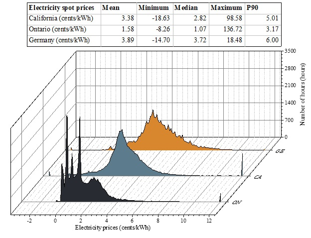
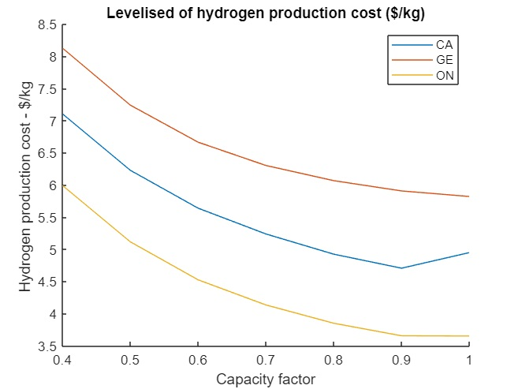

# LCOH-analysis
Techno-economic analysis of hydrogen production cost in wholesale electricity markets
Nguyen, T., Abdin, Z., Holm, T., & Mérida, W. (2019). Grid-connected hydrogen production via large-scale water electrolysis. Energy Conversion and Management, 200, 112108. 
Input:
- Dynamic electricity prices in Gernamy, California and Ontario wholesale markets.
 
- Water electrolysis system
 
Output
- Levelized cost of hydrogen ($/kg) versus the capacity factor or utilization factor
 

